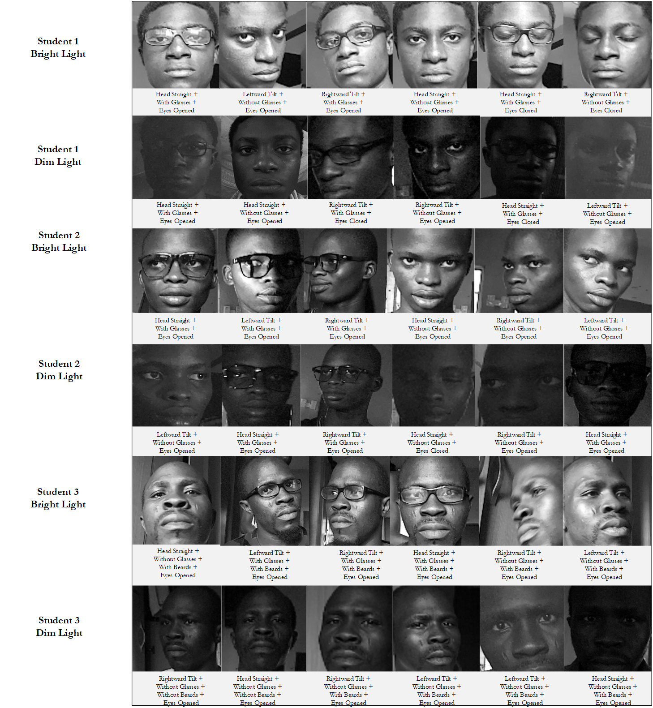
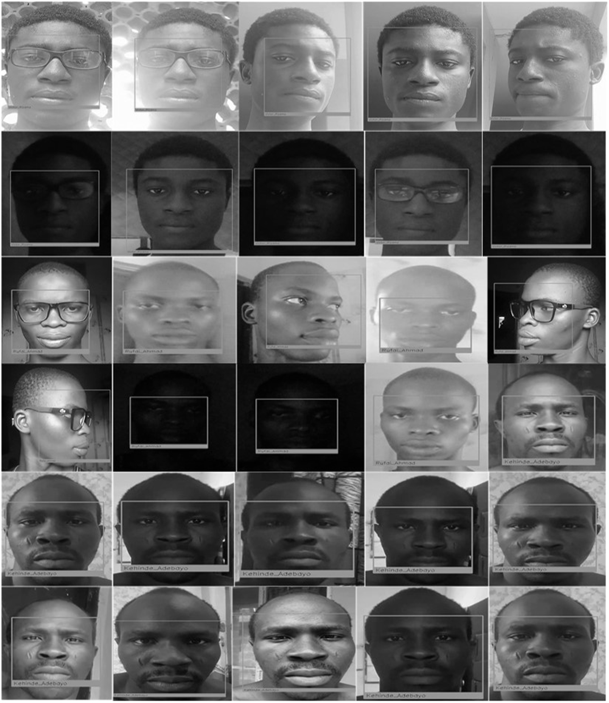
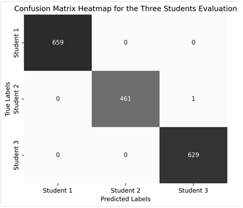
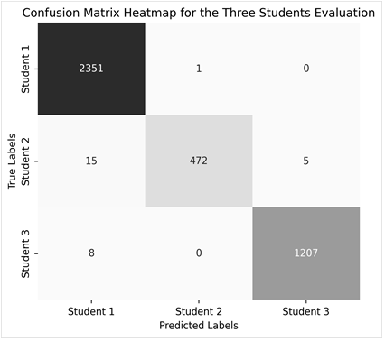

# Intelligent Facial Recognition 🪪 for Institutional Exam Attendance

This repository contains the implementation of my research titled _"Intelligent Facial Recognition for Institutional Exam Attendance"_ at the Department of Mechatronics Engineering (DOME), Federal University of Technology, Minna.

---

## 🧭 Overview
This research proposes a multi-facet facial recognition model based on the K-Nearest Neighbors (KNN) algorithm for recording and verifying student attendance during examination scenarios. The model was trained on a dataset of 990 images to operate under different conditions by leveraging pre-registered students’ data captured across multiple settings. The process involved face detection using a pre-trained Haar Cascade classifier, followed by face alignment and encoding into 128-dimensional vectors using a ResNet-based approach, which 
were then classified by the KNN algorithm. Evaluation across static images, video, and real-time camera feeds achieved an accuracy of over 99.00% with a response time of 6.00s seconds. Compared to traditional manual attendance systems, the proposed model provides an efficient solution for examination verification, effectively 
mitigating recognition challenges caused by varying environmental and facial conditions. 

---

## 🎯 Research Objectives

- To capture student facial data irrespective of subtle changes in facial appearance.
- To develop a facial recognition model capable of attendance authorizaton of examination students.
- To evaluate the model's performance in verifying student attendance authorization.

---

## ⚙️ Tools and Technologies Used

| **Tool / Library**                          | **Purpose in the Project**                                                                                                                  |
| ------------------------------------------- | ------------------------------------------------------------------------------------------------------------------------------------------- |
| **CSI Camera Module**                       | Use for capturing and inputting the facial image data of the students. |
| **OpenCV (cv2)**                            | Handled image capture, video processing, face detection (via Haar Cascade), drawing bounding boxes, and overlaying frames on the interface. |
| **os**                                      | Managed file paths, checked directory existence, accessed folders for datasets, and handled file creation.                                  |
| **numpy (np)**                              | Performed numerical operations and supported array manipulation needed in encoding and evaluation tasks.                                    |
| **Pillow (PIL)**                            | Provided additional image manipulation utilities during preprocessing.                                                                      |
| **face_recognition**                        | Detected faces, computed 128-dimensional face encodings, and provided core facial recognition functionality.                                |
| **pickle**                                  | Saved and loaded the trained KNN model and facial encodings for recognition and evaluation.                                                 |
| **scikit-learn (KNeighborsClassifier)**     | Implemented the K-Nearest Neighbors classifier used for facial recognition and prediction.                                                  |
| **glob**                                    | Located image file paths when loading training and testing datasets.                                                                        |
| **time**                                    | Measured timestamps and enabled timed delays, especially during attendance recording.                                                       |
| **csv**                                     | Read and wrote attendance records into CSV files with timestamps.                                                                           |
| **datetime**                                | Generated human-readable date and time formats for attendance entries.                                                                      |
| **win32com.client (Dispatch)**              | Enabled text-to-speech functionality for voice feedback (e.g., “Attendance Taken”).                                                         |
| **matplotlib.pyplot**                       | Created visualizations, especially confusion matrix heatmaps.                                                                               |
| **seaborn**                                 | Enhanced visualization aesthetics for plots such as heatmaps.                                                                               |
| **classification_report (sklearn.metrics)** | Provided precision, recall, and F1-score for evaluating model performance.                                                                  |
| **confusion_matrix (sklearn.metrics)**      | Computed confusion matrices used to assess correct and incorrect classification counts.                                                     |

---

## 📝 Methodology - Step by Step Implementation Procedure

 - **Video capture:** The camera module captured a live video feed and frames were read continuously.

- **Preprocessing:** Each frame was converted to grayscale and histogram equalization was applied to improve detection conditions.

- **Face detection:** A Haar Cascade classifier scanned each preprocessed frame, detecting candidate face bounding boxes at multiple scales.

- **Cropping:** Detected face regions were cropped from the original frame using the bounding box coordinates.

- **Face localization & landmark extraction:** Face locations were refined (HOG-based) and facial landmarks (68 points) were extracted to standardize alignment.

- **Feature encoding:** A ResNet-based model encoded aligned faces into 128-dimensional embedding vectors; embeddings were normalized using NumPy.

- **Model Training / classification:** The encoding were then trainedon on a KNN algorithm which compared incoming embeddings to stored embeddings to determine a match when similarity exceeded a configured threshold.

- **Attendance logging:** Recognized individuals were recorded in the attendance file with their ID and timestamp nnd unrecognized faces triggered the “unknown” protocol.

- **Visualization:** OpenCV overlaid bounding boxes and labels on the displayed frames to show recognition results in real time. The procedure then repeated for the next frame, enabling continuous, real-time attendance monitoring.

---

## Results

### 📷 The Student Facial Capturing and Real-time Recognition Results

  
     
    <em> Results for the Student Facial Capturing </em>

  
     
    <em> Real-time Recognition Results </em>

### Results for the Model Evaluation on Images

| Student    | Test Images | Images Processed | Images Not Processed | Precision | Recall | F1-Score |
|------------|-------------|------------------|---------------------|-----------|--------|----------|
| Student 1  | 1000        | 629              | 371                 | 1.0000    | 1.0000 | 1.0000   |
| Student 2  | 1000        | 462              | 538                 | 1.0000    | 0.9978 | 0.9989   |
| Student 3  | 1000        | 659              | 341                 | 0.9984    | 1.0000 | 0.9992   |

### Results for the Model Evaluation on Video

| Student    | Total Test Video Frames | Frames Processed | Frames Not Processed | Precision | Recall | F1-Score |
|------------|-------------------------|------------------|----------------------|-----------|--------|----------|
| Student 1  | 1544                    | 1215             | 329                  | 0.9959    | 0.9934 | 0.9946   |
| Student 2  | 699                     | 492              | 207                  | 0.9979    | 0.9593 | 0.9782   |
| Student 3  | 2930                    | 2352             | 578                  | 0.9903    | 0.9996 | 0.9949   |

### Confusion Matrix Results 

    
     
    <em> The Confusion Matrix for the Evaluation on Images</em>

    
     
    <em> The Confusion Matrix for the Evaluation on Videos</em>

### Discussion of Results

Observations on the evaluation metrics and confusion matrix for the images and videos shows that the model performed slightly better on images than on videos, consistently achieving near-perfect metrics for all students, with precision, recall, and F1-scores ranging from 0.9989 to 1.0000. In comparison, performance on videos remained excellent but showed small drops due to motion, lighting shifts, and frame variability, with metrics ranging from 0.9593 to 0.9996. Overall, the system demonstrated high accuracy in both modes, but static images provided the most stable recognition results.

---

## 💡 Research Novelty

The novelty and contribution of this research to knowledge was in the successful _**development and training of a multi-facet facial recognition model that accurately identified pre-registered students under different real-time conditions, specifically in varying lighting, head variations, and the use of accessories,  (limited to glasses and beards )**_. In contrast to conventional models, which often exhibited reduced performance under these conditions, this research improved the domain of intelligent educational attendance systems by providing a model that could be used for practical deployments in educational institutions. 

---

## ⚠️ Disclaimer

The scope of this research focused on training the facial recognition model using a dataset lmited to three pre-registered students. As a result, the model could only verify the attendance of these three individuals and was evaluated according to its ability to recognize them under challenging conditions, including dark and dim lighting, changes in appearance such as the presence or absence of beards and glasses, and variations in head position and orientation.

---

## 🔮Future Work

- Future improvements should address the challenge of distinguishing look-alike individuals (e.g., identical twins) through the creation of specialized impostor datasets for more rigorous testing.

- Although the current 128-dimensional embeddings provided strong discriminative power, expanding the dataset to include extreme lighting, wider head tilts, and additional accessories would further enhance robustness.

- Additional advancements could include integrating liveness detection to prevent spoofing, adopting advanced deep learning models such as CNNs or Transformers, and incorporating incremental learning to boost scalability and performance for larger examination cohorts.

---

## 📌 Note
Please kindly note that this README file is a summarized version of the full documentation of this research. The complete documentation, dataset and model weights can be provided upon request while the program implementation can be accessed via the [program script](KNN_Model_Development_For_Facial_Recognition.ipynb). 

---

